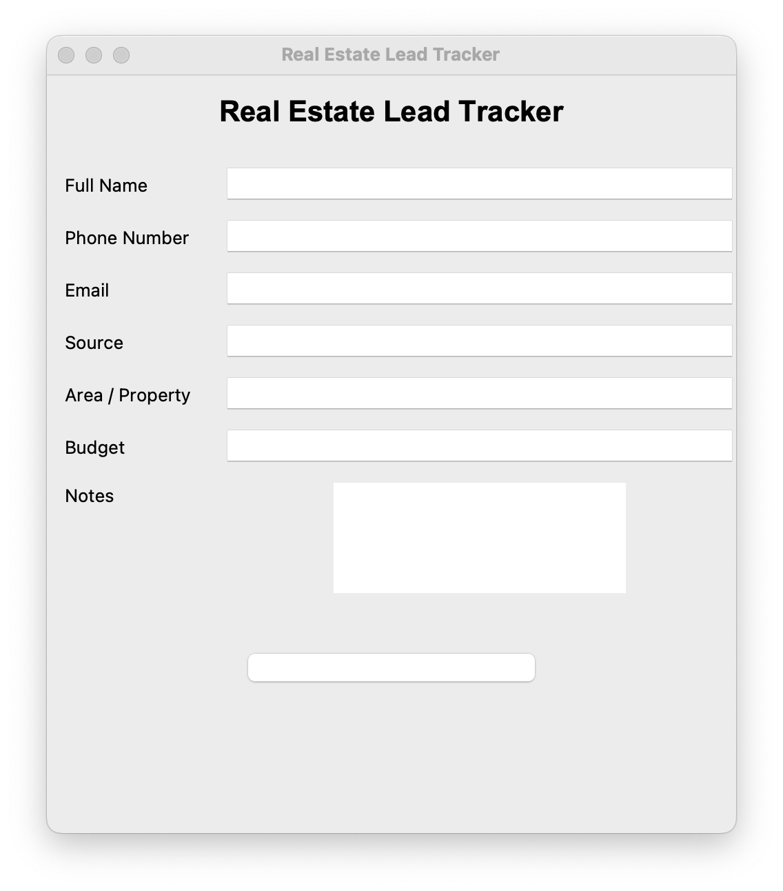
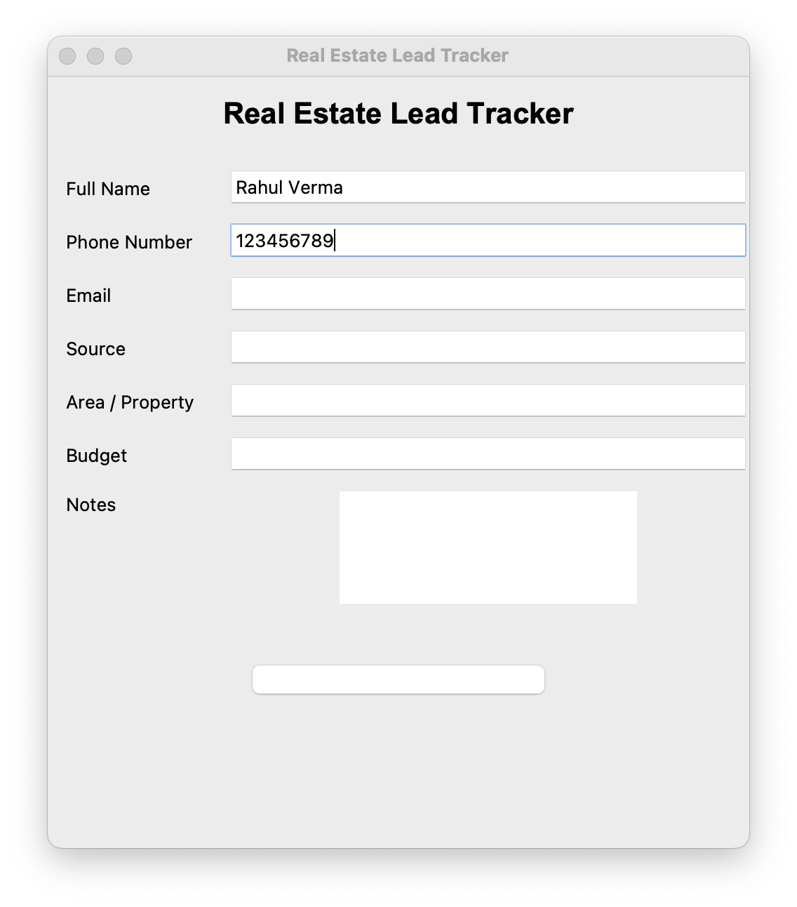
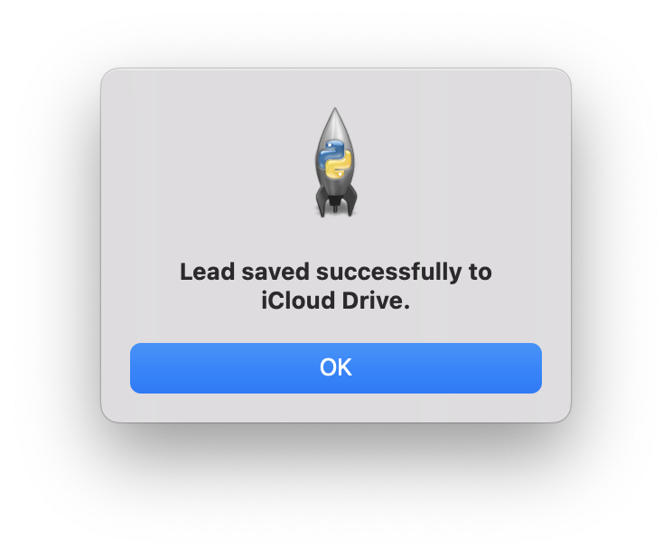
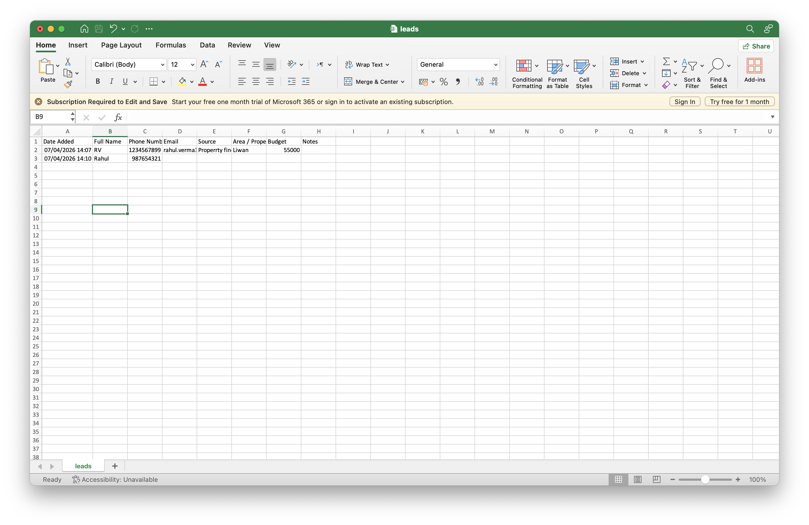

# 🏡 Real Estate Lead Tracker (macOS)

A Python desktop application that allows real estate agents to quickly save and manage client leads.
All lead data is automatically stored in **iCloud Drive**, ensuring easy access and backup across devices.

---

## ✨ Features

* 📥 Save lead details (Name, Phone, Email, Source, etc.)
* ☁️ Automatic saving to **iCloud Drive**
* 📅 Auto timestamp for each lead
* ✅ Required field validation
* 🧹 Form auto-clears after saving
* 💬 Success and error popups for better UX
* 🖥️ Simple and clean GUI using Tkinter

---

## 🛠 Tech Stack

* Python
* Tkinter (GUI)
* CSV (data storage)
* OS module (file handling)
* iCloud Drive (cloud sync)

---

## 📸 Screenshots

### Main App Window



### Filled Form



### Success Popup



### CSV Output



---

## ▶️ How to Run

```bash
python main.py
```

---

## ☁️ iCloud Storage Path

The CSV file is automatically saved to:

```bash
~/Library/Mobile Documents/com~apple~CloudDocs/LeadTracker/leads.csv
```

Make sure **iCloud Drive is enabled** on your Mac.

---

## 📂 Project Structure

```text
main.py  
leads.csv  
README.md  
Screenshots/  
```

---

## 🚀 Future Improvements

* Duplicate phone number detection
* Search leads feature
* Edit/Delete lead functionality
* Open CSV directly from app
* WhatsApp integration (click to chat)
* Dashboard with lead statistics

---

## 👨‍💻 Author

**Rahul Verma**
Python Developer | Automation Enthusiast
